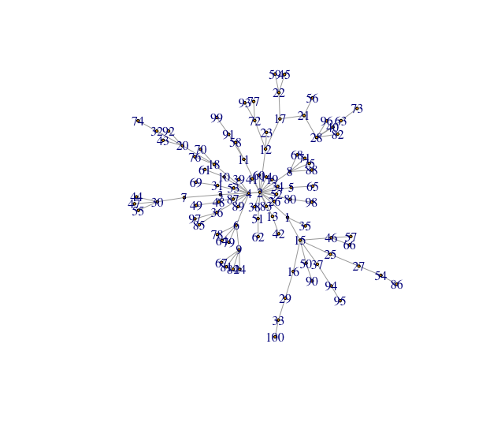
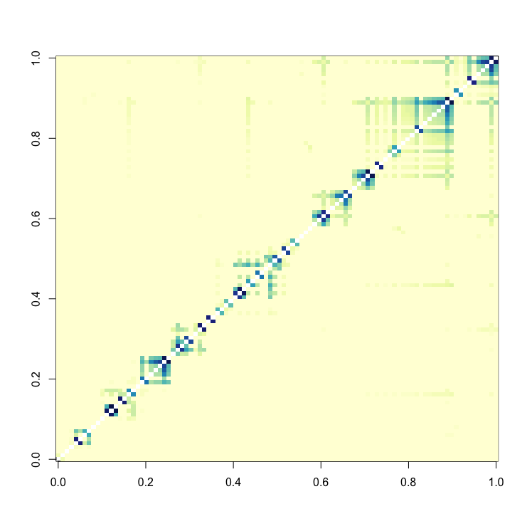

# Bowtie

Decoding the topology of large networks by constructing and visualizing weighted topological overlap (wTO) matrices to allow the mining of the functional information encoded in the topology. This R package applies multiprocessing to increase the wTO matrix calculation speed.

## Getting Started

Make sure you have devtools installed and loaded:
```R
install("devtools")
library("devtools")
```

Then install the bowtie package directly from github
```R
install_github("k-niss/bowtie")
library("bowtie")
```

You may have to install the github repertoire using R in the terminal instead of in Rstudio. After that you can just restart Rstudio and load the library in the standard way using library(bowtie).

### Prerequisites

Remember to install and then load the following packages before using the bowtie functions.

```R
library("igraph")       # Graph package
library("reshape2")     # Matrix manipulation
library("pbapply")      # Apply functions with multiprocessing and progress bar
library("parallel")     # For multiprocessing
library("RColorBrewer") # Nice colors
```

## Tutorials

Below in part A, we present how to calculate a wTO matrix based on an igraph object and followlingly how to visualize it. In part B, we illustrate how to extract protein complexes and knot proteins from a network adjacency matrix of direct interaction scores and how to visualize the results.

### Tutorial part A: Creating and visualizing a wTO matrix

Create a toy network using the igraph function sample_pa() and visualize it:
```R
random_graph           = sample_pa(n=100, power = 1.2, directed=F)
E(random_graph)$weight = runif(n=length(E(random_graph)))
plot(random_graph, vertex.size=2, layout=igraph::layout.gem(random_graph))
```

<p align="center">
  
</p>

The algorithm will create a graph resembling the one above.

Calculate pariwise weighted topological overlap (wTO) for all node pairs:
```R
wTO_list = wTO.network(node_vector=as.vector(V(random_graph)), igraph_object=random_graph, thread_numb=2)
```


Convert the list format into a symmetric wTO matrix:
```R
wTO_matrix = from.list.to.df(wTO_list)
```


Order the columns and rows of the matrix, to make patterns stand out:
```R
hclust_object = hclust(as.dist(1-wTO_matrix), method='average')
node_order    = hclust_object$labels[hclust_object$order]
```


Visualize the matrix to get an overview of the topology:
```R
image(wTO_matrix[node_order,node_order], useRaster=T, col=colorRampPalette(brewer.pal(9,"YlGnBu"))(49))
```

<p align="center">
  
</p>

It is clear from the visualization that the network does not contain modular strucutres. However, we can observe highly connected nodes, i.e. hubs.

### Tutorial part B: Locating protein complexes and bow-tie motifs

Since the toy network in part A do not contain modular structures, we load an adjacency matrix of the cDC1 cell, which is included in the bowtie R package.
```R
data()
```


We locate the protein complexes in the adjacency matrix.
```R
protein_complex_areas    = find_complexes(full_matrix = int_matrix_all)
protein_complexes_merged = merge_complexes(protein_complex_areas)
```


We then locate the bow-tie motifs in the adjacency matrix.
```R
knot_proteins_and_fans = find_bowties(full_matrix = int_matrix_all, protein_complex_areas = protein_complexes_merged)
```

## Authors

* **PhD Student Kristoffer Niss** - *Coding and conceptual work* 
* **Professor Søren Brunak** - *Conceptual work and supervision* 

## Affiliation

Translational Disease Systems Biology Group, Novo Nordisk Foundation center for Protein Research (CPR), University of Copenhagen, 2200 Copenhagen, Denmark. 

## Scientific paper

This R package is not published yet. 

## License

This project is licensed under the MIT License - see the [LICENSE.md](LICENSE.md) file for details

## Acknowledgments

* Thank you to Tibor Varga and Grigorii Nos for help with setting up the R package
